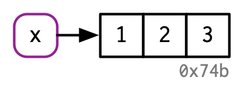
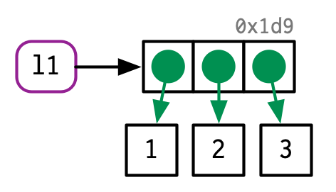
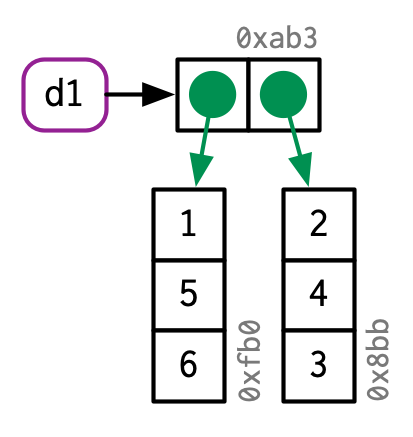
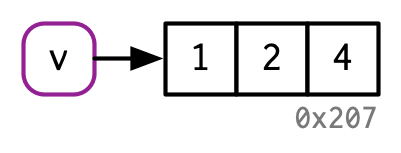

Advanced R
========================================================
author: Dr G. Maribe 
date: 21 August 2019
autosize: true
<!-- incremental: true -->

Why put yourself though this ?
========================================================

<style>
.midcenter {
    position: fixed;
    top: 50%;
    left: 50%;
}
</style>

<div class="midcenter" style="margin-left:-300px; margin-top:-100px;">
</img>
</div>


Why R?
========================================================

__If you are new to R, you might wonder what makes learning such a quirky language worthwhile. To me, some of the best features are:__
<small>
- It's free, open source, and available on every major platform. As a result, if you do your analysis in R, anyone can easily replicate it, regardless of where they live or how much money they earn.

- R has a diverse and welcoming community, both online (e.g. the `#rstats` twitter community) and in person (like the many R meetups).

- A massive set of packages for statistical modelling, machine learning, visualisation, and importing and manipulating data. Whatever model or graphic you're trying to do, chances are that someone has already tried to do it and you can learn from their efforts.

</small>

Why R?
========================================================

<small>

- Powerful tools for communicating your results. RMarkdown makes it easy to turn your results into HTML files, PDFs, Word documents, PowerPoint presentations, dashboards and more. Shiny allows you to make beautiful interactive apps without any knowledge of HTML or javascript.

- RStudio, the IDE, provides an integrated development environment, tailored to the needs of data science, interactive data analysis, and statistical programming.

- Cutting edge tools. Researchers in statistics and machine learning will often publish an R package to accompany their articles. This means immediate access to the very latest statistical techniques and implementations.

</small>

Why R?
========================================================

<small>

- Deep-seated language support for data analysis. This includes features like missing values, data frames, and vectorisation.

- A strong foundation of functional programming. The ideas of functional programming are well suited to the challenges of data science, and the R language is functional at heart, and provides many primitives needed for effective functional programming.

- Powerful metaprogramming facilities. R's metaprogramming capabilities allow you to write magically succinct and concise functions and provide an excellent environment for designing domain-specific languages like ggplot2, dplyr, data.table, and more.

- The ease with which R can connect to high-performance programming languages like C, Fortran, and C++.

</small>

Why R?
========================================================

<small>
__Of course, R is not perfect. R's biggest challenge (and opportunity!) is that most R users are not programmers. This means that:__

- Much of the R code you'll see in the wild is written in haste to solve a pressing problem. As a result, code is not very elegant, fast, or easy to understand. Most users do not revise their code to address these shortcomings.

- Compared to other programming languages, the R community is more focussed on results than processes. Knowledge of software engineering best practices is patchy. For example, not enough R programmers use source code control or automated testing.

- Metaprogramming is a double-edged sword. Too many R functions use tricks to reduce the amount of typing at the cost of making code that is hard to understand and that can fail in unexpected ways.

- R is not a particularly fast programming language, and poorly written R code can be terribly slow. R is also a profligate user of memory.

</small>

Introduction
========================================================
To start your journey in mastering R, the following six chapters will help you learn the foundational components of R. It is expected that you've already seen many of these pieces before, but you probably have not studied them deeply.

<small>

1. __Chapter 2__ teaches you about an important distinction that you probably haven't thought deeply about: the difference between an object and its name. Improving your mental model here will help you make better predictions about when R copies data and hence which basic operations are cheap and which are expensive.

2. __Chapter 3__ dives into the details of vectors, helping you learn how the different types of vector fit together. You'll also learn about attributes, which allow you to store arbitrary metadata, and form the basis for two of R's object-oriented programming toolkits.

</small>

Introduction
========================================================

<small>

3. __Chapter 4__ describes how to use subsetting to write clear, concise, and efficient R code. Understanding the fundamental components will allow you to solve new problems by combining the building blocks in novel ways.

4. __Chapter 5__ presents tools of control flow that allow you to only execute code under certain conditions, or to repeatedly execute code with changing inputs. These include the important if and for constructs, as well as related tools like switch() and while.

5. __Chapter 6__ deals with functions, the most important building blocks of R code. You'll learn exactly how they work, including the scoping rules, which govern how R looks up values from names. You'll also learn more of the details behind lazy evaluation, and how you can control what happens when you exit a function.

</small>

Introduction
========================================================
<small>

6. __Chapter 7__ describes a data structure that is crucial for understanding how R works, but quite unimportant for data analysis: the environment. Environments are the data structure that binds names to values, and they power important tools like package namespaces. Unlike most programming languages, environments in R are "first class" which means that you can manipulate them just like other objects.

7. __Chapter 8__ concludes the foundations of R with an exploration of "conditions", the umbrella term used to describe errors, warnings, and messages. You've certainly encountered these before, so in this chapter you learn how to signal them appropriately in your own functions, and how to handle them when signalled elsewhere.

</small>

2. Names and values
========================================================
__In R, it is important to understand the distinction between an object and its name. Doing so will help you:__

- More accurately predict the performance and memory usage of your code.
- Write faster code by avoiding accidental copies, a major source of slow code.
- Better understand R's functional programming tools.

We'll use the lobstr package to dig into the internal representation of R objects.


```r
library(lobstr)
```


2.2 Binding basics
========================================================

Consider this code:


```r
x <- c(1, 2, 3)
```
It's easy to read it as: "create an object named `x`, containing the values `1, 2, and 3`". Unfortunately, that's a simplification that will lead to inaccurate predictions about what R is actually doing behind the scenes. It's more accurate to say that this code is doing two things:

It's creating an object, a vector of values, `c(1, 2, 3)`.
And it's binding that object to a name, `x`.

In other words, the object, or value, doesn't have a name; it's actually the name that has a value.

2.2 Binding basics
========================================================

To further clarify this distinction, let's draw a diagram


The name, `x`, is drawn with a rounded rectangle. It has an arrow that points to (or binds or references) the value, the vector `c(1, 2, 3)`. 

The arrow points in opposite direction to the assignment arrow: `<-` creates a binding from the name on the left-hand side to the object on the right-hand side.

2.2 Binding basics
========================================================

Thus, you can think of a name as a reference to a value. For example, if you run this code, you don't get another copy of the value `c(1, 2, 3)`, you get another binding to the existing object:


These identifiers have a special form that looks like the object's memory "address", i.e. the location in memory where the object is stored. But because the actual memory addresses changes every time the code is run, we use these identifiers instead.

2.2 Binding basics
========================================================

You can access an object's identifier with lobstr::obj_addr(). Doing so allows you to see that both x and y point to the same identifier:

```r
obj_addr(x)
```

```
[1] "0x154b8438"
```

```r
obj_addr(y)
```

```
[1] "0x154b8438"
```
These identifiers are long, and change every time you restart R.

2.2.1 Non-syntactic names
========================================================
R has strict rules about what constitutes a valid name. A syntactic name must consist of letters, digits, `.` and `_` but can't begin with `_` or a digit. Additionally, you can't use any of the reserved words like `TRUE`, `NULL`, `if`, and `function` (see the complete list in `?Reserved`). A name that doesn't follow these rules is a non-syntactic name; if you try to use them, you'll get an error:


```r
_abc <- 1
#> Error: unexpected input in "_"

if <- 10
#> Error: unexpected assignment in "if <-"
```


2.3 Copy-on-modify
========================================================
Consider the following code. It binds `x` and `y` to the same underlying value, then modifies `y`


```r
x <- c(1, 2, 3)
y <- x

y[[3]] <- 4
x
```

```
[1] 1 2 3
```


Modifying y clearly didn't modify `x`. So what happened to the shared binding? While the value associated with `y` changed, the original object did not.

2.3 Copy-on-modify
========================================================
This behaviour is called copy-on-modify. Understanding it will radically improve your intuition about the performance of R code. A related way to describe this behaviour is to say that R objects are unchangeable, or immutable.


You can see when an object gets copied with the help of base::tracemem(). Once you call that function with an object, you'll get the object's current address:

2.3 Copy-on-modify: `tracemem()`
========================================================


```r
x <- c(1, 2, 3)
cat(tracemem(x), "\n")
#> <0x7f80c0e0ffc8> 
```

From then on, whenever that object is copied, tracemem() will print a message telling you which object was copied, its new address, and the sequence of calls that led to the copy:

```r
y <- x
y[[3]] <- 4L
#> tracemem[0x7f80c0e0ffc8 -> 0x7f80c4427f40]: 
```

If you modify y again, it won't get copied. That's because the new object now only has a single name bound to it, so R applies modify-in-place optimisation

2.3 Copy-on-modify: Function calls
========================================================
The same rules for copying also apply to function calls. Take this code:

```r
f <- function(a) {
  a
}

x <- c(1, 2, 3)
cat(tracemem(x), "\n")
#> <0x8fe4a28>

z <- f(x)
# there's no copy here!

untracemem(x)
```

While `f()` is running, the a inside the function points to the same value as the `x` does outside the function


2.3.3 Lists
========================================================
It's not just names (i.e. variables) that point to values; elements of lists do too. Consider this list, which is superficially very similar to the numeric vector above:

```r
l1 <- list(1, 2, 3)
```

This list is more complex because instead of storing the values itself, it stores references to them:



2.3.3 Lists
========================================================
This is particularly important when we modify a list:

```r
l2 <- l1

l2[[3]] <- 4
```

</img>
<td>
</img>

2.3.3 Lists
========================================================

Like vectors, lists use copy-on-modify behaviour; the original list is left unchanged, and R creates a modified copy. This, however, is a shallow copy: the list object and its bindings are copied, but the values pointed to by the bindings are not.

To see values that are shared across lists, use `lobstr::ref()`. `ref()` prints the memory address of each object, along with a local ID so that you can easily cross-reference shared components.


2.3.3 Lists
========================================================


```r
lobstr::ref(l1, l2)
```

```
o [1:0x17909ee0] <list> 
+-[2:0x1223d378] <dbl> 
+-[3:0x1223d340] <dbl> 
\-[4:0x1223d308] <dbl> 
 
o [5:0x12216ad0] <list> 
+-[2:0x1223d378] 
+-[3:0x1223d340] 
\-[6:0x124292f0] <dbl> 
```

2.3.4 Data frames
========================================================
Data frames are lists of vectors, so copy-on-modify has important consequences when you modify a data frame. Take this data frame as an example:


```r
d1 <- data.frame(x = c(1, 5, 6), y = c(2, 4, 3))
```



2.3.4 Data frames
========================================================

If you modify a column, only that column needs to be modified; the others will still point to their original references:


```r
d2 <- d1
d2[, 2] <- d2[, 2] * 2
```
</img>


2.3.4 Data frames
========================================================
However, if you modify a row, every column is modified, which means every column must be copied:


```r
d3 <- d1
d3[1, ] <- d3[1, ] * 3
```
</img>

2.3.5 Character vectors
========================================================
<small>The final place that R uses references is with character vectors4. Even though we draw character vectors like this:</small>

```r
x <- c("a", "a", "abc", "d")
```
</img>

<small>
This is a polite fiction. R actually uses a global string pool where each element of a character vector is a pointer to a unique string in the pool:
</small>
</img>


2.3.5 Character vectors
========================================================
You can request that `lobstr::ref()` show these references by setting the character argument to `TRUE`:


```r
ref(x, character = TRUE)
```

```
o [1:0x19791288] <chr> 
+-[2:0x12ec76b8] <string: "a"> 
+-[2:0x12ec76b8] 
+-[3:0x19744700] <string: "abc"> 
\-[4:0x130bbd00] <string: "d"> 
```

This has a profound impact on the amount of memory a character vector uses but is otherwise generally unimportant.

2.4 Object size
========================================================
You can find out how much memory an object takes with `lobstr::obj_size()`

```r
obj_size(letters)
#> 1,712 B
obj_size(ggplot2::diamonds)
#> 3,456,344 B
```

2.5 Modify-in-place
========================================================
As we've seen above, modifying an R object usually creates a copy. There are two exceptions:
<small>
- Objects with a single binding get a special performance optimisation.
- Environments, a special type of object, are always modified in place.
</small>

### Objects with a single binding
If an object has a single name bound to it, R will modify it in place:

```r
v <- c(1, 2, 3)
```


2.5 Modify-in-place: single binding
========================================================

```r
v[[3]] <- 4
```


(Note the object IDs here: v continues to bind to the same object, 0x207.)

It's generally difficult to predict exactly when R applies this optimisation. It is however possible to to determine this empirically with `tracemem()`


2.5 Modify-in-place: single binding
========================================================

<small>
Let's explore the subtleties with a case study using for loops. For loops have a reputation for being slow in R, but often that slowness is caused by every iteration of the loop creating a copy. Consider the following code. It subtracts the median from each column of a large data frame:
</small>


```r
x <- data.frame(matrix(runif(5 * 1e4), ncol = 5))
medians <- vapply(x, median, numeric(1))

for (i in seq_along(medians)) {
  x[[i]] <- x[[i]] - medians[[i]]
}
```

This loop is surprisingly slow because each iteration of the loop copies the data frame. You can see this by using `tracemem():`

2.5 Modify-in-place: single binding
========================================================

```r
cat(tracemem(x), "\n")
#> <0x7f80c429e020> 

for (i in 1:5) {
  x[[i]] <- x[[i]] - medians[[i]]
}
#> tracemem[0x7f80c429e020 -> 0x7f80c0c144d8]: 
#> tracemem[0x7f80c0c144d8 -> 0x7f80c0c14540]: [[<-.data.frame [[<- 
#> tracemem[0x7f80c0c14540 -> 0x7f80c0c145a8]: [[<-.data.frame [[<- 
#...
untracemem(x)
```

2.5 Modify-in-place: single binding
========================================================
In fact, each iteration copies the data frame not once, not twice, but three times! Two copies are made by `[[.data.frame`, and a further copy is made because `[[.data.frame` is a regular function that increments the reference count of `x`.

We can reduce the number of copies by using a list instead of a data frame. Modifying a list uses internal C code, so the references are not incremented and only a single copy is made:

2.5 Modify-in-place: single binding
========================================================

```r
y <- as.list(x)
cat(tracemem(y), "\n")
#> <0x7f80c5c3de20>
  
for (i in 1:5) {
  y[[i]] <- y[[i]] - medians[[i]]
}
#> tracemem[0x7f80c5c3de20 -> 0x7f80c48de210]: 
```


2.5.2 Environments
========================================================
<small>
Environments are always `modified in place`. This property is sometimes described as __reference semantics__ because when you modify an environment all existing bindings to that environment continue to have the same reference. Take this environment, which we bind to `e1` and `e2`:</small>


```r
e1 <- rlang::env(a = 1, b = 2, c = 3)
e2 <- e1
```


2.5.2 Environments
========================================================
If we change a binding, the environment is modified in place:

```r
e1$c <- 4
e2$c
#> [1] 4
```


2.5.2 Environments
========================================================
This basic idea can be used to create functions that "remember" their previous state. One consequence of this is that environments can contain themselves:


```r
e <- rlang::env()
e$self <- e

lobstr::ref(e)
```

```
o [1:0x17a6e128] <env> 
\-self = [1:0x17a6e128] 
```

2.6 Unbinding and the garbage collector
========================================================
Consider this code:

```r
x <- 1:3
```
</img>

```r
x <- 2:4
```
</img>

2.6 Unbinding and the garbage collector
========================================================

```r
rm(x)
```
</img>


```r
gc()
```

```
          used (Mb) gc trigger (Mb) max used (Mb)
Ncells  555434 29.7    1154622 61.7  1154622 61.7
Vcells 1091366  8.4    8388608 64.0  1797812 13.8
```
